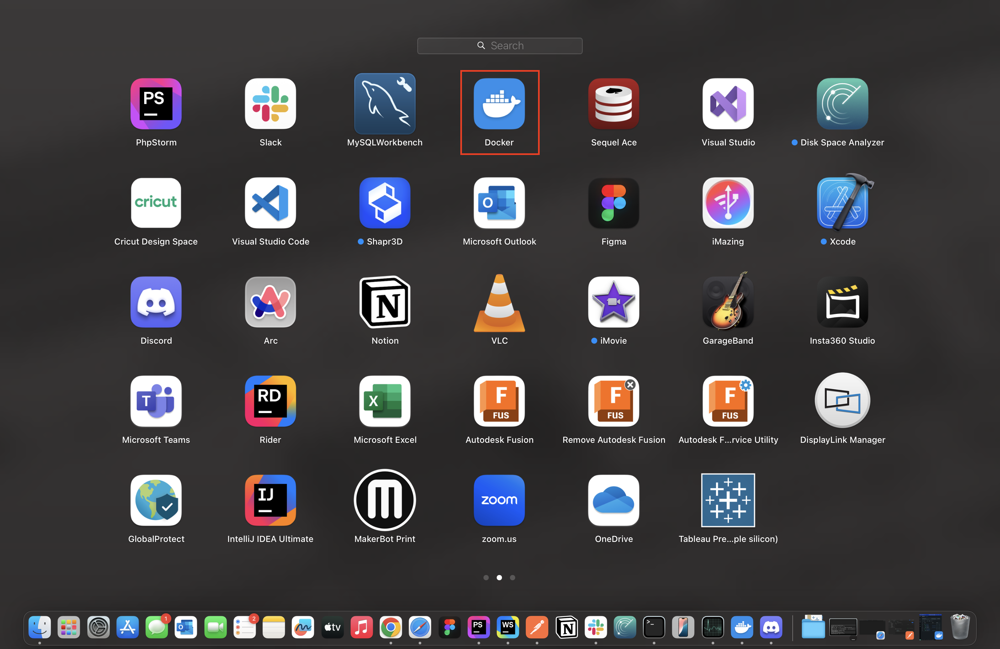

# Vote Vault Frontend

Make sure to visit [vote-vault-api](https://github.com/KyuXCode/vote-vault-api) repository as well to connect to api endpoint

## Install Prerequisites

### Install Docker Desktop
- Install Docker Desktop on your machine from this [documentation](https://docs.docker.com/get-started/get-docker/) or the link below.
    - [Mac](https://docs.docker.com/desktop/install/mac-install/)
    - [Windows](https://docs.docker.com/desktop/install/windows-install/)
    - [Linux](https://docs.docker.com/desktop/install/linux/)

## Start the Project Locally

- Open the Docker Desktop app before the next stage 
- Make sure you're in the ```vote-vault-frontend``` directory
- Start the docker container
    ```
    docker compose up --build
    ```
- Go to your browser and enter this link: [http://127.0.0.1:3000/](http://127.0.0.1:3000/), you should see the React frontend. 
    
